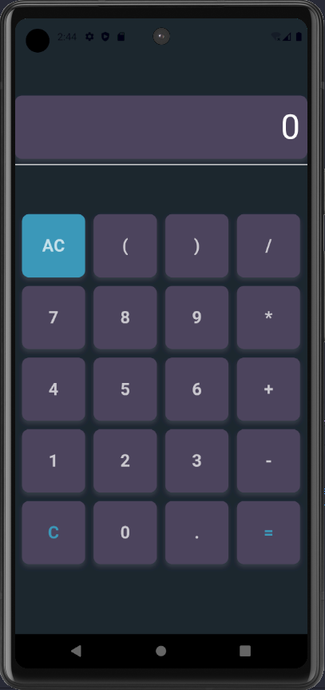

# Flutter Chat

Proyek ini adalah aplikasi Flutter Chat sederhana.

<div style="display: flex; ">
  
  
  
  
   
</div>


## Menjalankan Aplikasi

Pastikan Anda telah menginstal [Flutter](https://flutter.dev/docs/get-started/install) di sistem Anda sebelum melanjutkan.

1. Buka terminal atau command prompt.

2.Masuk ke direktori untuk backend_chat yang
   ```bash
   cd path/ke/backend_chat
   ```

3.Jalankan project backend
   ```bash
   npm start
   ```
4. Biarkan terminal hidup
   
5. Pindah ke direktori proyek Flutter Chat:

   ```bash
   cd path/ke/flutter-chat
   ```

6. Instal dependensi proyek:

   ```bash
   flutter pub get
   ```

7. Jalankan aplikasi Flutter:

   ```bash
   flutter run
   ```

8. Tunggu hingga aplikasi Flutter terbuka di simulator atau perangkat.

## Fitur Aplikasi

- **Fitur 1:** Chat yang terenkripsi
- **Fitur 2:** Emoticon.
- **...**

## Struktur Proyek

Penjelasan tentang struktur proyek dapat ditemukan di direktori `lib`.

## Dependensi

Daftar dependensi proyek dapat ditemukan di berkas `pubspec.yaml`.

## Catatan

- Pastikan perangkat atau simulator Anda terhubung dan siap untuk menjalankan aplikasi Flutter.

- Sesuaikan skrip start, dependensi, dan instruksi sesuai dengan konfigurasi proyek Anda.

- Anda mungkin perlu mengatur konfigurasi khusus atau variabel lingkungan sesuai kebutuhan proyek Flutter Chat ini.

## Lisensi

Proyek ini dilisensikan di bawah lisensi [MIT](LICENSE).

